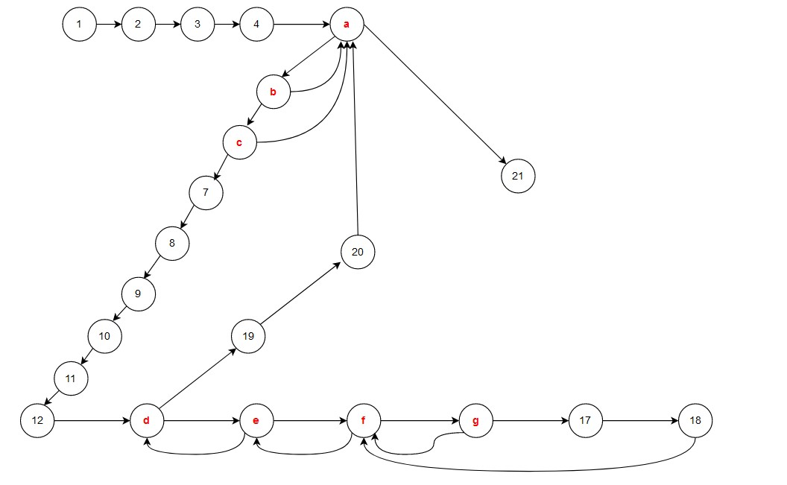

# 测试用例分析

## 一.判断三角形类型

### 1.问题分析

#### 1.1.输入变量

三个float型变量：a  b  c， 用于表示三角形的三边

#### 1.2.限定变量范围

规定三角形三边 a  b  c 均需在（0，100】范围内

#### 1.3.输出变量

输出特定格式：“equilateral triangle”、“isosceles triangle”、“normal triangle”、“not a triangle”、“negative”、“can't be 0”、“exceed”

|       输出信息       |                             备注                             |
| :------------------: | :----------------------------------------------------------: |
| equilateral triangle |               等边三角形：“a == b and b == c”                |
|  isosceles triangle  |           等腰三角形：“a == b or a == c or b == c”           |
|   normal triangle    |                          普通三角形                          |
|    not a triangle    | 不构成三角形：“not ( a + b > c and a + c > b and b + c > a )” |
|       negative       |       输入错误（小于零）：“ a < 0 or b < 0 or c < 0 ”        |
|      can't be 0      |          输入错误（等于零）：“a==0 or b==0 or c==0”          |
|        exceed        |      输入错误（超限）：“a > 100 or b > 100 or c > 100 ”      |

### 2.测试用例

#### 2.1.边界值分析测试用例

基于单缺陷假设，使用弱健壮边界值分析（在原本基本边界值测试的基础上，加入健壮性测试）

需要考虑的值为：略低于最小值、最小值、略高于最小值、正常值、略低于最大值、最大值、略高于最大值

> 基本边界值测试：最小值、略高于最小值、正常值、略低于最大值、最大值
>
> 健壮边界值测试：略低于最小值、略高于最大值

则总测试用例个数为：`7n-(n-1) = 6n+1`，共19个

测试用例表格如下：

|  ID  | 参数1（a） | 参数2（b） | 参数3（c） |    Expect Output     | Actual Output | Result | Analysis Strategy | Person | Defect Description |
| :--: | :--------: | :--------: | :--------: | :------------------: | :-----------: | :----: | :---------------: | :----: | :----------------: |
|  1   |     -2     |     50     |     50     |  edge A is negative  |               |        |  健壮边界值测试   |        |                    |
|  2   |     0      |     49     |     51     |  edge A can't be 0   |               |        |  基本边界值测试   |        |                    |
|  3   |     1      |     50     |     50     |  isosceles triangle  |               |        |  基本边界值测试   |        |                    |
|  4   |     50     |     50     |     50     | equilateral triangle |               |        |  基本边界值测试   |        |                    |
|  5   |     99     |     49     |     52     |   normal triangle    |               |        |  基本边界值测试   |        |                    |
|  6   |    100     |     50     |     50     |    not a triangle    |               |        |  基本边界值测试   |        |                    |
|  7   |    101     |     49     |     51     |    edge A exceed     |               |        |  健壮边界值测试   |        |                    |
|  8   |     50     |     -1     |     49     |  edge B is negative  |               |        |  健壮边界值测试   |        |                    |
|  9   |     49     |     0      |     49     |  edge B can't be 0   |               |        |  基本边界值测试   |        |                    |
|  10  |     50     |     1      |     50     |  isosceles triangle  |               |        |  基本边界值测试   |        |                    |
|  11  |     50     |     99     |     50     |  isosceles triangle  |               |        |  基本边界值测试   |        |                    |
|  12  |     50     |    100     |     50     |    not a triangle    |               |        |  基本边界值测试   |        |                    |
|  13  |     49     |    101     |     51     |    edge B exceed     |               |        |  健壮边界值测试   |        |                    |
|  14  |     50     |     50     |     -1     |  edge C is negative  |               |        |  健壮边界值测试   |        |                    |
|  15  |     50     |     50     |     0      |  edge C can't be 0   |               |        |  基本边界值测试   |        |                    |
|  16  |     50     |     50     |     1      |  isosceles triangle  |               |        |  基本边界值测试   |        |                    |
|  17  |     50     |     50     |     99     |  isosceles triangle  |               |        |  基本边界值测试   |        |                    |
|  18  |     49     |     52     |    100     |   normal triangle    |               |        |  基本边界值测试   |        |                    |
|  19  |     50     |     50     |    101     |    edge C exceed     |               |        |  健壮边界值测试   |        |                    |


#### 2.2.等价类分析测试用例

基于弱一般等价类测试

输出结果为：“equilateral triangle”、“isosceles triangle”、“normal triangle”、“not a triangle”

“not a triangle” 中还包括 “negative”、“can't be 0”、“exceed”

划分等价类如下：

> D1 = {{a,b,c}|三条边a,b,c构成的等边三角形}
>
> D2 = {{a,b,c}|三条边a,b,c构成的非等边等腰三角形}
>
> D3 = {{a,b,c}|三条边a,b,c构成的非等边非等腰的一般三角形}
>
> D4 = {{a,b,c}|三条边a,b,c不构成三角形}

由于取值范围为 (0，100]，对于每个变量，补充弱健壮测试用例：略低于最小值、最小值、略高于最大值

于是，总测试用例个数为 `4+3*3=13`

综上所述，测试用例表格如下：

|  ID  | 参数1（a） | 参数2（b） | 参数3（c） |    Expect Output     | Actual Output | Result | Analysis Strategy | Person | Defect Description |
| :--: | :--------: | :--------: | :--------: | :------------------: | :-----------: | :----: | :---------------: | :----: | :----------------: |
|  1   |     25     |     25     |     25     | equilateral triangle |               |        | 弱一般等价类测试  |        |                    |
|  2   |     62     |     62     |     50     |  isosceles triangle  |               |        | 弱一般等价类测试  |        |                    |
|  3   |     9      |     10     |     11     |   normal triangle    |               |        | 弱一般等价类测试  |        |                    |
|  4   |     25     |     20     |     50     |    not a triangle    |               |        | 弱一般等价类测试  |        |                    |
|  5   |     -1     |     70     |     40     |  edge A is negative  |               |        | 弱健壮等价类测试  |        |                    |
|  6   |     0      |     25     |     25     |  edge A can't be 0   |               |        | 弱健壮等价类测试  |        |                    |
|  7   |    101     |     50     |     45     |    edge A exceed     |               |        | 弱健壮等价类测试  |        |                    |
|  8   |     25     |     -1     |     30     |  edge B is negative  |               |        | 弱健壮等价类测试  |        |                    |
|  9   |     50     |     0      |     45     |  edge B can't be 0   |               |        | 弱健壮等价类测试  |        |                    |
|  10  |     46     |    101     |     58     |    edge B exceed     |               |        | 弱健壮等价类测试  |        |                    |
|  11  |     50     |     49     |     -1     |  edge C is negative  |               |        | 弱健壮等价类测试  |        |                    |
|  12  |     25     |     30     |     0      |  edge C can't be 0   |               |        | 弱健壮等价类测试  |        |                    |
|  13  |     60     |     75     |    101     |    edge C exceed     |               |        | 弱健壮等价类测试  |        |                    |


## 二.万年历问题

### 1.问题分析

#### 1.1.输入变量

三个整型变量：year、month、day，用于表示年、月、日

#### 1.2.限定变量范围

- 对于year，规定范围为【2000，2100】
- 对于month，规定范围为【1，12】
- 对于day，规定大月和小月，大月为【1，31】；小月为【1，30】；二月比较特殊，闰年为【1，29】，平年为【1，28】

#### 1.3.输出变量

输出变量为输入变量的后一天，同样用三个变量存储：`ret_y / ret_m / ret_d`

若存在输入错误，则会输出相应的提示信息：

> 年低于最小值："year is lower than 2000"；年超过最大值："year exceeded"
>
> 月低于最小值："month is lower than 1"；月高于最大值："month exceeded"
>
> 日低于最小值："day is lower than 1"；日高于最大值："day exceeded"

### 2.测试用例

#### 2.1.边界值分析测试用例

由于万年历问题三个变量之间的联系，为多缺陷问题，需要进行最坏情况边界分析，而整体的笛卡尔积测试用例过多，这里仅添加了不同年月的二月、大月、小月测试

因此，总测试用例个数为：`7*3-（3-1）+4 = 23`个

|  ID  | 参数1（Y） | 参数2（M） | 参数3（D） |      Expect Output      | Actual Output | Result | Analysis Strategy | Person | Defect Description |
| :--: | :--------: | :--------: | :--------: | :---------------------: | :-----------: | :----: | :---------------: | :----: | :----------------: |
|  1   |    1999    |     5      |     20     | year is lower than 2000 |               |        | 健壮性边界值分析  |        |                    |
|  2   |    2000    |     5      |     20     |        2000/5/21        |               |        |  基本边界值分析   |        |                    |
|  3   |    2001    |     5      |     50     |        2001/5/21        |               |        |  基本边界值分析   |        |                    |
|  4   |    2045    |     6      |     28     |        2045/6/29        |               |        |  基本边界值分析   |        |                    |
|  5   |    2099    |     7      |     31     |        2099/8/1         |               |        |  基本边界值分析   |        |                    |
|  6   |    2100    |     3      |     16     |        2100/3/17        |               |        |  基本边界值分析   |        |                    |
|  7   |    2101    |     2      |     19     |      year exceeded      |               |        | 健壮性边界值分析  |        |                    |
|  8   |    2077    |     0      |     18     |  month is lower than 1  |               |        | 健壮性边界值分析  |        |                    |
|  9   |    2077    |     1      |     25     |        2077/1/26        |               |        |  基本边界值分析   |        |                    |
|  10  |    2077    |     2      |     21     |        2077/2/22        |               |        |  基本边界值分析   |        |                    |
|  11  |    2077    |     11     |     29     |       2077/11/30        |               |        |  基本边界值分析   |        |                    |
|  12  |    2077    |     12     |     15     |       2077/12/16        |               |        |  基本边界值分析   |        |                    |
|  13  |    2077    |     14     |     21     |     month exceeded      |               |        | 健壮性边界值分析  |        |                    |
|  14  |    2055    |     5      |     0      |   day is lower than 1   |               |        | 健壮性边界值分析  |        |                    |
|  15  |    2055    |     5      |     1      |        2055/5/2         |               |        |  基本边界值分析   |        |                    |
|  16  |    2055    |     5      |     3      |        2055/5/4         |               |        |  基本边界值分析   |        |                    |
|  17  |    2055    |     5      |     30     |        2055/5/31        |               |        |  基本边界值分析   |        |                    |
|  18  |    2055    |     5      |     31     |        2055/6/1         |               |        |  基本边界值分析   |        |                    |
|  19  |    2055    |     5      |     32     |      day exceeded       |               |        | 健壮性边界值分析  |        |                    |
|  20  |    2020    |     2      |     29     |        2020/3/1         |               |        | 最坏情况边界分析  |        |                    |
|  21  |    2021    |     2      |     29     |      day exceeded       |               |        | 最坏情况边界分析  |        |                    |
|  22  |    2077    |     5      |     31     |        2077/6/1         |               |        | 最坏情况边界分析  |        |                    |
|  23  |    2077    |     4      |     31     |      day exceeded       |               |        | 最坏情况边界分析  |        |                    |


## 三.讨论题

> 讨论题：在一销售管理系统中，其中的一个模块负责对公司员工进行年终考评，考评综合考虑职工在公司工作时间长短（计年）、每年请假的次数（不能超过20天，20天以上，包括20天，则免于年终考评）、员工在公司的级别（分1，2，3，4，5个级别）及本年度的销售总额，考评的结果最高以5分计，公司成立于2000年初，该软件的设计使用周期到2035年底，请回答下列问题：
> (1)	用基本边界值的测试方法，一共有多少测试用例；最坏情况边界值有多少测试用例。
> (2)	根据健壮的边界值测试法，写出“工作时间长短”为非正常值情况下的测试用例。

测试用例的输入变量：

- 职工在公司工作时间长短
- 每年请假的次数
- 员工在公司的级别
- 员工本年度的销售总额

测试输出：考评分数（5分计）

### 1.用基本边界值的测试方法

对于基本边界值测试，每一个变量都需要取：最小值、略高于最小值、中间值、略低于最大值、最大值五种取值，除选定变量外，其余变量需保持为中间值，因此每个变量都取中间值的情况会有重复，取其一即可。

**总测试用例为  `5*4-（4-1） = 17` 个**

### 2.最坏情况边界值测试方法

最坏情况基于多缺陷假设，即程序的失效是由于两个（或多个）变量值在其边界值附近取值共同引起的，对于每个变量，首先取包含最小值、略高于最小值、中间值、略低于最大值、最大值构成一个集合，然后对这些集合进行笛卡尔积

**就本题而言，总测试用例为 `5^4 = 625` 个**

### 3.健壮的边界值测试法

首先确定变量定义域

> 规定：T = 职工在公司工作时间长短
>
> ​		   N = 每年请假的次数
>
> ​		    L = 员工在公司的级别
>
> ​		    S = 员工本年度的销售总额
>
> 定义域为：
>
> ​			0 <= T <= 35		 T为整数
>
> ​			0 <= N <= 19		N为整数
>
> ​			0 <= L <= 5	    	L为整数
>
> ​			S >= 0					S为实数

工作时间长短为非正常值，健壮的边界值测试法中其余变量均为正常值，测试用例如下：

|  ID  | 参数1（T） | 参数2（N） | 参数3（L） | 参数4（S） | Expect Output | Actual Output | Result | Analysis Strategy | Person | Defect Description |
| :--: | :--------: | :--------: | :--------: | :--------: | :-----------: | :-----------: | :----: | :---------------: | :----: | :----------------: |
|  1   |     -1     |     9      |     3      |   50000    |   输入错误    |               |        |  健壮性边界分析   |        |                    |
|  2   |     36     |     9      |     3      |   50000    |   输入错误    |               |        |  健壮性边界分析   |        |                    |


## 十五.根据C语言程序，构建程序图

按照下列C语言程序前的编号，构建起程序图（control flow graph or program diagram），不需要理解具体的代码实现内容，只要理解其逻辑即可。

```
0 void ModuleX (int x, int y, int Wid, char *Str)
   {
1     unsigned  Zcode, Bcode;                    
2     int  i, j, k, Rec, Color;
3     long Len;
4     char Buf[72];
5    while (*Str)                               
        {
6      if ((*Str & 0x80) && (*(Str+1) &0x80))  
            {
7        Zcode = (*Str-0xa1) & 0x07f;          
8        Bcode = (*(Str+1)-0xa1) & 0x07f;      
9        Rec = Zcode*94+Bcode;                 
10        Len = Rec*72L;                        
11        fseek(fp, Len, SEEK_SET);
12        fread (Buf, 1, 72, fp);               
13        for (i = 0; i < 24; i++)
14         for (j = 0; j < 3; j++)
15           for (k = 0; k < 8; k++)
16             if (Buf[i*3+j] >> (7-k) & 1)
                   {
17                  Color = y+j*8+k-46;
18                  PutPoint(x+i, y+j*8+k, Color);
16-1             }
19        x = x+24+Wid;
20        Str += 2;
6-1     }
5-1   }
21      return;
     }
```

根据以上程序，为在程序图中表示方便，简化判断条件，简化如下：

> a:	*Str 
>
> b:	*Str & 0x80 
>
> c:	*(Str + 1) & 0x80 
>
> d:	i < 24 
>
> e:	j < 3 
>
> f:	K < 8 
>
> g:	Buf[i*3+j] >> (7-k) & 1


程序图如下：

